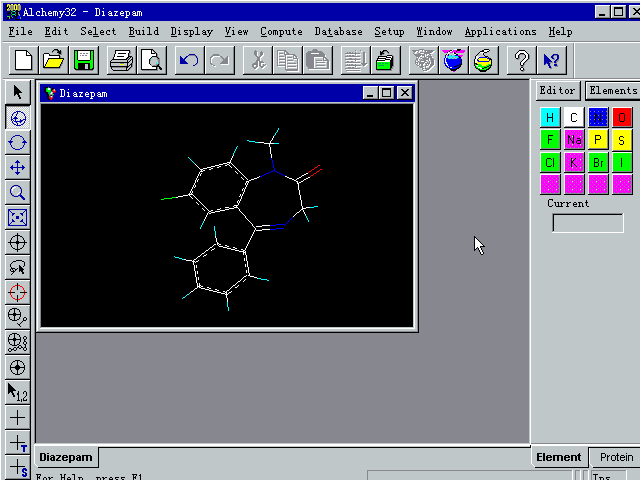

# cadd_suite_win98

## 欢迎使用带有 CADD 套件的 Windows 98！

此镜像附带了 Alchemy 2000，SciVision Logp，SciVision QSAR。

这里提供两个镜像：

1. Vmware 的镜像文件`win98_with_CADD_Suite.7z`。解压后导入 Vmware 即可运行（推荐）。

2. img 文件`win98_with_CADD_Suite.img`。可以烧录到U盘启动，或者在这里运行 [https://copy.sh/v86](https://copy.sh/v86)。但是 v86 模拟器无法上传文件，你可以点击`Get hard disk image`将镜像连同文件导出，然后提取文件。

**你可以在这里下载所需要的版本：[https://github.com/Metaphorme/cadd_suite_win98/releases](https://github.com/Metaphorme/cadd_suite_win98/releases)**

## Todo

1. Vmware 上有一些硬件驱动无法运行，但不对软件使用造成影响。
   
2. v86 模拟器上有一些硬件驱动无法运行，但不对软件使用造成影响。

3. 可能可以用这个项目进行包装：https://github.com/felixrieseberg/windows95

## 许可

该项目仅用于教育和存档目的。目前市面上非常难以寻找 Alchemy 2000，SciVision Logp，SciVision QSAR 的安装介质和使用环境，因此创建了这个存档来保存这些软件。

它不属于也并未经过 Alchemy 2000，SciVision Logp，SciVision QSAR 的作者或公司批准。

它不属于也并未经过 Microsoft 批准。
